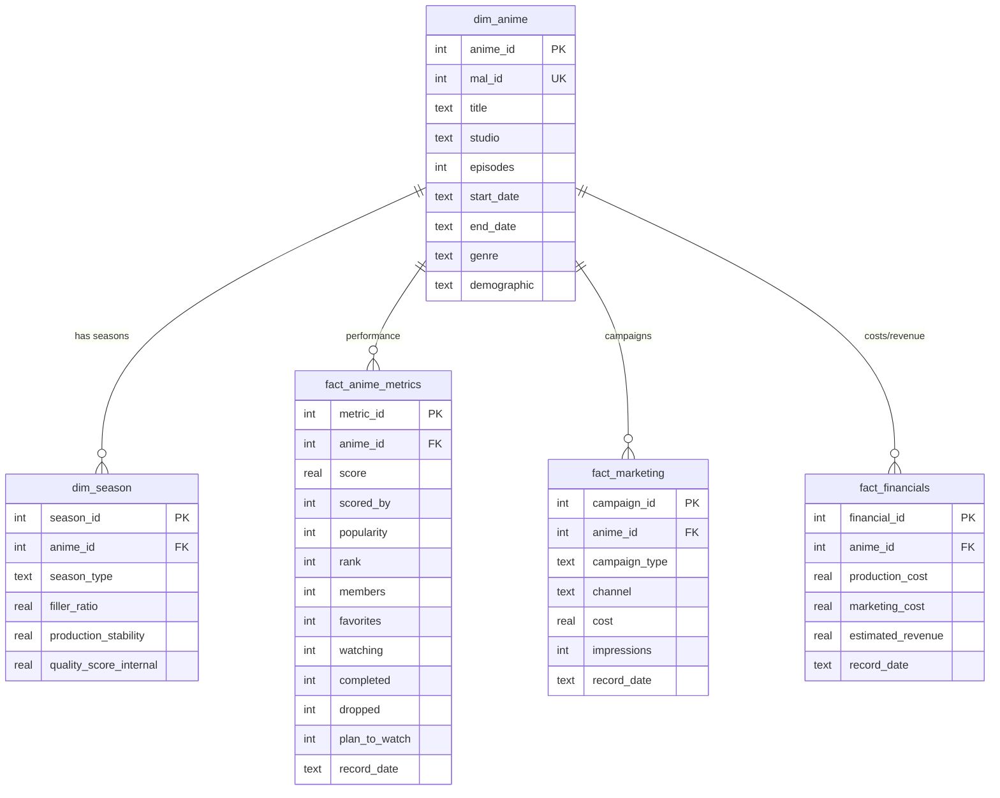

# Studio Pierrot Anime BI – Data Model

## Overview
This data warehouse uses a **star schema** to analyze Studio Pierrot anime performance, combining public MyAnimeList data with simulated internal production and marketing metrics.

## Star Schema Diagram

## Table Descriptions

### Dimensions

#### `dim_anime`
Core anime attributes from MyAnimeList.

| Column | Type | Description |
|--------|------|-------------|
| `anime_id` | INTEGER | Primary key (surrogate) |
| `mal_id` | INTEGER | MyAnimeList ID (business key) |
| `title` | TEXT | Anime title |
| `studio` | TEXT | Production studio (e.g., "Studio Pierrot") |
| `episodes` | INTEGER | Total episode count |
| `start_date` | TEXT | First air date (ISO format) |
| `end_date` | TEXT | Last air date (ISO format) |
| `genre` | TEXT | Comma-separated genres |
| `demographic` | TEXT | Target demographic (shounen, seinen, etc.) |

#### `dim_season`
Season-level production metadata (simulated internal data).

| Column | Type | Description |
|--------|------|-------------|
| `season_id` | INTEGER | Primary key |
| `anime_id` | INTEGER | Foreign key to `dim_anime` |
| `season_type` | TEXT | "long" (100+ eps) or "short" (12–24 eps) |
| `filler_ratio` | REAL | % of filler episodes (0.0–1.0) |
| `production_stability` | REAL | Internal quality index (0.0–1.0) |
| `quality_score_internal` | REAL | Studio quality rating (0.0–10.0) |

### Facts

#### `fact_anime_metrics`
MyAnimeList performance metrics.

| Column | Type | Description |
|--------|------|-------------|
| `metric_id` | INTEGER | Primary key |
| `anime_id` | INTEGER | Foreign key to `dim_anime` |
| `score` | REAL | Average user rating (0.0–10.0) |
| `scored_by` | INTEGER | Number of users who rated |
| `popularity` | INTEGER | MAL popularity rank |
| `rank` | INTEGER | MAL overall rank |
| `members` | INTEGER | Total members |
| `favorites` | INTEGER | Total favorites |
| `watching` | INTEGER | Currently watching count |
| `completed` | INTEGER | Completed count |
| `dropped` | INTEGER | Dropped count |
| `plan_to_watch` | INTEGER | Plan-to-watch count |
| `record_date` | TEXT | Snapshot date (ISO format) |

#### `fact_marketing`
Simulated marketing campaign data.

| Column | Type | Description |
|--------|------|-------------|
| `campaign_id` | INTEGER | Primary key |
| `anime_id` | INTEGER | Foreign key to `dim_anime` |
| `campaign_type` | TEXT | "TV", "Digital", "Event", etc. |
| `channel` | TEXT | Specific channel/platform |
| `cost` | REAL | Campaign cost (USD) |
| `impressions` | INTEGER | Total impressions |
| `record_date` | TEXT | Campaign date (ISO format) |

#### `fact_financials`
Simulated cost and revenue data.

| Column | Type | Description |
|--------|------|-------------|
| `financial_id` | INTEGER | Primary key |
| `anime_id` | INTEGER | Foreign key to `dim_anime` |
| `production_cost` | REAL | Production cost (USD) |
| `marketing_cost` | REAL | Marketing cost (USD) |
| `estimated_revenue` | REAL | Estimated revenue (USD) |
| `record_date` | TEXT | Record date (ISO format) |

## Business Questions

This model supports analysis of:

1. **Performance comparison**: How do recent anime (Boruto, Tokyo Ghoul:re) compare to classics (Naruto, Bleach)?
2. **Structural factors**: Does filler ratio, production stability, or season type correlate with lower ratings?
3. **Engagement trends**: Are recent shows seeing higher drop rates or lower completion rates?
4. **ROI analysis**: Which titles have the best estimated revenue vs. production/marketing costs?
5. **Risk identification**: Which current projects show warning signs (low engagement, declining ratings)?

## Data Sources

- **Public**: MyAnimeList API or CSV export
- **Simulated**: Python-generated production metrics, marketing campaigns, and financials
