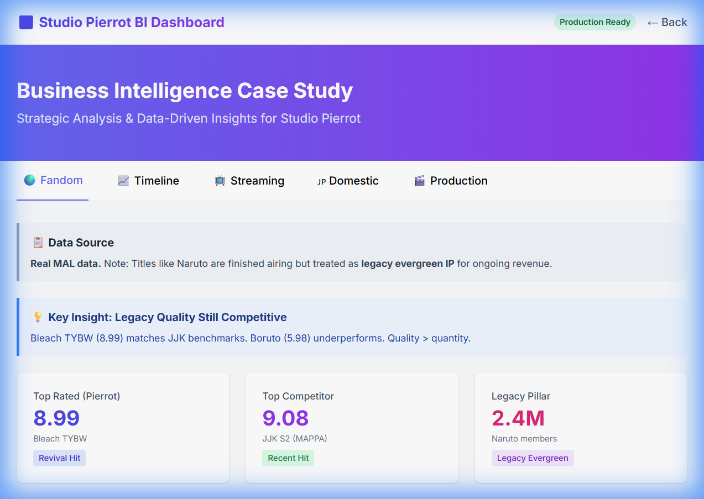

# Studio Pierrot BI Analysis

## 📋 Project Context

**Type:** Self-directed Business Intelligence case study (personal learning project)

**Strategic Question:** *Why are Studio Pierrot's flagship IPs (Naruto, Bleach, Tokyo Ghoul, Black Clover) struggling to capture the same global momentum as newer titles like Jujutsu Kaisen (MAPPA) and Demon Slayer (ufotable)—and what should they do about it?*

This project demonstrates end-to-end BI workflow by combining **domestic (Japan), international streaming, global fandom data, and revenue timeline analysis (2020-2024)** to provide actionable recommendations. Built alongside the Google BI Professional Certificate.

> **Note:** This is a portfolio/learning project. Not affiliated with Studio Pierrot. Financial metrics are simulated and calibrated to industry benchmarks.

**Strategic Context:**
- Global anime market: $34B (2024) → projected $60B+ by 2030
- International streaming revenue: $3.7B → $12.5B by 2030
- Jujutsu Kaisen (MAPPA) was named "Most in-demand TV series in the world" in 2023 at 71.2x average demand
- Netflix + Crunchyroll control >80% of overseas anime streaming market
- Pierrot's legacy IPs dominate Netflix, but new titles fail to match MAPPA/ufotable quality perception

---

## 🎯 Delivered Capabilities



This project demonstrates a complete BI workflow from requirements to dashboard delivery:

### 📊 Interactive Multi-Tab Dashboard
- **5 Analytical Lenses:** Global Fandom, Timeline (2020-2024), Streaming Analytics, Domestic Japan, Production Insights
- **Revenue Profile Taxonomy:** Legacy Evergreen, Revival Hit, Recent Hit, Long Run
- **Time-Series Analysis:** Revenue trends showing momentum shifts (Naruto $42M→$34M decline vs JJK $20M→$48M surge)
- **KPIs & Insights:** Score comparisons, member engagement, demand indices, production models

### 📈 Business Intelligence Artifacts
- **Star Schema Warehouse:** SQLite with facts/dimensions (revenue_profile, broadcast_status fields)
- **Python ETL Pipeline:** Extract (Jikan API) → Transform → Load to warehouse
- **Tableau Export Package:** 4 CSV files (`tableau_exports/`) + comprehensive README with visualization suggestions
- **Strategic Documentation:** Executive requirements, stakeholder specs, data dictionary, recommendations

### 💡 Key Insights Delivered
- **Production Model Impact:** Seasonal (<10% filler) = 8.7 avg score vs Continuous (42% filler) = 6.1
- **Revenue Momentum:** Legacy IP declining while competitor hits surge (+140% for JJK)
- **Streaming Gap:** JJK 71.2x demand vs Pierrot portfolio 2-12x
- **Revival Success:** Bleach TYBW proves Pierrot CAN compete with 8.99 score when investing in quality

---

## 📊 Data Sources & Limitations

### Real Data (Global Fandom Lens)
**Source:** MyAnimeList via [Jikan API](https://jikan.moe/)
- Live scores, members, favorites, popularity rankings
- **Limitation:** MAL has Western bias; Japanese domestic fans rarely use it
- **Use Case:** Proxy for global online anime fandom sentiment

**Dataset Scope:** ~25-30 major anime IPs covering Studio Pierrot catalog (Naruto, Bleach, Tokyo Ghoul, Black Clover, Boruto) plus recent blockbusters (Jujutsu Kaisen, Demon Slayer, Spy x Family, Blue Lock, etc.) for competitive benchmarking.

### Market Context (Public Reports)
**Sources:** Parrot Analytics, Netflix reports, industry publications
- Platform market share (Netflix ~52% anime watchers, Crunchyroll ~85% anime-focused)
- Global demand indices (JJK 71.2x benchmark)
- Streaming revenue projections and regional growth rates
- **Use Case:** Calibrate simulated data against real industry trends

### Simulated Data (Domestic & Streaming Lenses)
**Note:** Production costs, TV ratings, BD sales, merchandise revenue are **modeled for this project**
- Calibrated against known market sizes (e.g., Oricon BD sales rankings, standard production budgets)
- **Not actual Studio Pierrot financials**
- **Transparency:** All simulated data clearly marked in dashboard and documentation

---

## 🏗️ Technical Architecture

### Dimensional Data Warehouse (Star Schema)
**Tables:**
- **Facts:** `fact_rating_snapshot`, `fact_revenue_stream`, `fact_production_episode`
- **Dimensions:** `dim_anime` (with `revenue_profile`, `broadcast_status`), `dim_date`, `dim_platform`, `dim_region`

### ETL Pipeline
1. **Extract:** Python script (`et/extract_mal.py`) fetches raw JSON from Jikan API
2. **Transform:** Data cleaning, standardization, revenue profile classification
3. **Load:** Python script (`etl/load_warehouse.py`) populates SQLite warehouse with upsert logic
4. **Export:** Dashboard data (`etl/export_to_dashboard.py`) and Tableau CSVs (`tableau_exports/`)

### Dashboard Stack
- **Frontend:** Vanilla JS + Chart.js for interactive visualizations
- **Data Layer:** Real-time MAL data + simulated metrics exported to `dashboard/data.js`
- **Styling:** Tailwind CSS with responsive design

---

## 🛠️ How to Run

### View the Dashboard
- **Local:** Open `dashboard/index.html` in your browser
- **Live:** Visit [GitHub Pages deployment](https://dylanelo.github.io/Portfolio/projects/studio-pierrot-bi/dashboard/index.html)

### Run ETL Pipeline

> **Note:** The ETL pipeline has been streamlined for ease of use. All commands below should work on first try.

```bash
# Navigate to project directory
cd projects/studio-pierrot-bi

# Install dependencies (one-time setup)
pip install requests

# === OPTION A: Quick Start (All-in-One) ===
# This initializes the database and loads sample data in one step
python etl/load.py

# === OPTION B: Full Pipeline (Recommended for fresh data) ===
# Step 1: Initialize database with warehouse schema (first time only)
python etl/load.py

# Step 2: Extract fresh data from MyAnimeList
python etl/extract_mal.py

# Step 3: Load extracted data into warehouse
python etl/load_warehouse.py

# Step 4: Export data for dashboard visualization
python etl/export_dashboard_data.py
```

**What each script does:**
- `load.py` – Initializes SQLite database with `warehouse/schema.sql`, loads sample MAL data
- `extract_mal.py` – Fetches latest anime data from Jikan API into `data/raw_mal_data.json`
- `load_warehouse.py` – Transforms and loads data into star schema tables
- `export_dashboard_data.py` – Exports warehouse data to `dashboard/data.js` for visualization

**Legacy Scripts (For Reference Only):**
- `etl/init_db.py` – Uses deprecated `model/schema.sql`; kept for transparency
- `model/schema_v2.sql` – Experimental version; not used in production pipeline

*Requires Python 3.x and `requests` library*


### Tableau Integration
1. Import CSVs from `tableau_exports/` directory
2. Follow `tableau_exports/README_TABLEAU.md` for visualization suggestions
3. Suggested dashboards: Competitive Position, Production Quality Analysis, Market Evolution 2020-2024

---

## 📚 Project Documentation

**Strategic & Requirements:**
- `docs/executive_requirements.md` - C-level dashboard expectations
- `docs/stakeholder_requirements.md` - Cross-functional team needs
- `docs/strategy_document.md` - Project goals, success metrics
- `docs/data_model_spec.md` - Star schema specification

**Implementation:**
- `DATA_DICTIONARY.md` - Field definitions and business logic
- `CV_LINKEDIN_DESCRIPTION.md` - Professional project descriptions
- `tableau_exports/README_TABLEAU.md` - Tableau import guide

---

## 📚 References

- [Netflix Anime Statistics (2025)](https://www.gamesradar.com/entertainment/anime-shows/)
- [Jujutsu Kaisen Global Demand Analysis](https://www.parrotanalytics.com/announcements/)
- [Anime Streaming Market Projections](https://www.parrotanalytics.com/press/)
- [Grand View Research: Anime Market Report (2030)](https://www.grandviewresearch.com/industry-analysis/anime-market)
