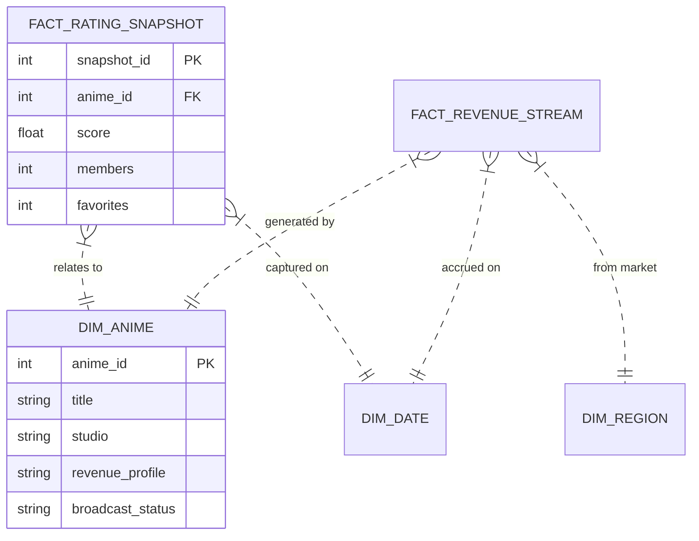

# Data Model Specification: Star Schema

## 1. Overview
The data warehouse is designed as a **Star Schema** to optimize query performance for the BI dashboard. It centers on fact tables containing metrics (ratings, revenue) linked to dimension tables containing descriptive attributes (anime details, dates).

## 2. Schema Diagram

## 3. Dimension Tables

### `dim_anime`
- **Description:** Master list of anime titles.
- **Key Fields:**
    - `anime_id` (PK): Unique identifier.
    - `title`: Official English title.
    - `studio`: Primary animation studio (e.g., Pierrot, MAPPA).
    - `revenue_profile`: Business category (LegacyTail, NewHit, RevivalHit, LongRun).
    - `broadcast_status`: Airing status (Finished, Airing, Hiatus).

### `dim_date`
- **Description:** Calendar dimension for time-series analysis.
- **Key Fields:** `date_id`, `year`, `quarter`, `month`.

## 4. Fact Tables

### `fact_rating_snapshot`
- **Description:** Daily snapshots of MyAnimeList metrics.
- **Key Metrics:** `score` (0-10), `members` (count), `favorites` (count).
- **Grain:** One row per anime per day.

### `fact_revenue_stream`
- **Description:** Simulated revenue data for dashboarding.
- **Key Metrics:** `revenue_amount_usd`.
- **Grain:** One row per anime per year per region.

## 5. Data Flow
1.  **Extract:** JSON from Jikan API.
2.  **Transform:** Python script maps JSON fields to schema columns; assigns `revenue_profile` logic.
3.  **Load:** SQLite `INSERT OR REPLACE` to handle updates.
